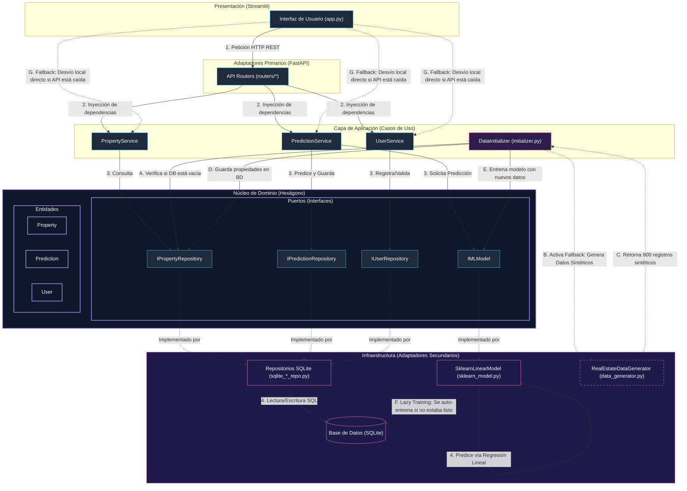

# Tasador Automático de Bienes Raíces 🏠📈

Este es un proyecto Full-Stack diseñado para demostrar la integración de un modelo de Machine Learning y gestión de persistencia bajo los principios de la **Arquitectura Hexagonal (Puertos y Adaptadores)**, separando de manera estricta las responsabilidades y reglas del negocio de las tecnologías e infraestructuras externas.

## Arquitectura del Proyecto

El backend está estructurado siguiendo el patrón de **Arquitectura Hexagonal (Ports & Adapters)**. La lógica central del dominio de negocio es independiente de tecnologías externas y se comunica con el exterior a través de **puertos** (interfaces) y **adaptadores** (implementaciones concretas):

1. **Domain (Dominio / Núcleo del Hexágono):**
   - **Entities:** Modelos de negocio puros (`User`, `Property`, `Prediction`) libres de dependencias de frameworks o bases de datos.
   - **Ports (Puertos):** Interfaces abstractas que definen los contratos para interactuar con bases de datos u otros servicios externos (`user_repository`, `property_repository`, `prediction_repository`, `ml_model_port`).

2. **Application (Aplicación / Casos de Uso):**
   - **Services:** Implementación de los casos de uso (`UserService`, `PropertyService`, `PredictionService`) que orquestan las operaciones del negocio interactuando con los puertos de dominio.
   - **Initializer:** Encargado de instanciar y conectar los servicios y adaptadores al iniciar la aplicación.

3. **Infrastructure (Infraestructura / Adaptadores Secundarios o Driven Adapters):**
   - **Persistence:** Base de datos relacional local en SQLite, repositorios concretos que implementan las interfaces (puertos) del dominio.
   - **ML (Machine Learning):** Implementación concreta de la predicción y generación de datos a través de Scikit-Learn.

4. **Adapters (Adaptadores de API / Adaptadores Primarios o Driving Adapters):**
   - Controladores y enrutadores construidos en **FastAPI** que traducen las solicitudes HTTP entrantes en llamadas a la capa de aplicación.

El **Frontend** está construido en **Streamlit** y se comunica directamente con la API RESTful (Adaptador Primario).

### Diagrama de Arquitectura y Flujos

A continuación se detalla la arquitectura hexagonal del sistema, ilustrando tanto el **Flujo Normal** de peticiones como los mecanismos de **Fallback e Inicialización**:



#### Descripción detallada de los flujos:

1. **Flujo Normal (Líneas Continuas):**
   * El usuario interactúa con la interfaz de **Streamlit**, por ejemplo, solicitando una predicción.
   * El frontend realiza una llamada HTTP POST a `/api/predict_and_save` en **FastAPI**.
   * FastAPI delega la petición en la capa de aplicación ejecutando el caso de uso `PredictionService`.
   * El servicio interactúa directamente con los puertos del dominio (`IPredictionRepository` e `IMLModel`).
   * La infraestructura concreta realiza la predicción (vía `SklearnLinearModel`) y la guarda en la base de datos **SQLite** mediante `SQLitePredictionRepository`.

2. **Flujo de Fallback e Inicialización (Líneas Discontinuas/Destacadas):**
   * **Auto-Seeding (Base de Datos Vacía):** Al arrancar la aplicación, si el repositorio detecta que no hay propiedades registradas, el inicializador (`DataInitializer`) ejecuta el fallback de generación sintética mediante `RealEstateDataGenerator`. Este genera un dataset de 800 inmuebles realistas para poblar la base de datos y permitir el arranque del sistema.
   * **Entrenamiento Lazy (Decoupling):** Para evitar fallos si el modelo de Machine Learning no ha sido entrenado de forma explícita al momento de arrancar la API, el modelo implementa un flujo de fallback interno (`_ensure_trained()`) que lo auto-entrena cargando los datos actuales de la base de datos SQLite antes de responder a una predicción.
   * **Mecanismo de Fallback de Conexión en el Frontend:** Si el backend de FastAPI no se encuentra en línea (o se cae la conexión), el `DataClient` del frontend captura automáticamente el error de conexión (`ConnectionError`) y cambia a modo local/offline de manera **completamente transparente**. Se conecta directamente a la base de datos SQLite e invoca los mismos servicios de dominio de forma local, mostrando un indicador de advertencia en el sidebar en lugar de interrumpir la aplicación.

---

## Estructura de Directorios

```text
c:\streamlit_stadistica\
├── backend/
│   ├── domain/                         # Capa de Dominio (Reglas e Interfaces del Negocio)
│   │   ├── entities/                   # Entidades de dominio (User, Property, Prediction)
│   │   └── ports/                      # Puertos / Interfaces abstractas de persistencia e IA
│   │
│   ├── application/                    # Capa de Aplicación (Casos de Uso)
│   │   ├── services/                   # Servicios del negocio
│   │   └── initializer.py              # Configuración y arranque de servicios
│   │
│   ├── infrastructure/                 # Capa de Infraestructura (Tecnologías Concretas)
│   │   ├── persistence/                # Base de datos SQLite y Repositorios SQL
│   │   └── ml/                         # Entrenamiento y predicciones del modelo Scikit-Learn
│   │
│   ├── adapters/                       # Capa de Adaptadores de Interfaz
│   │   └── api/                        # Configuración de FastAPI, Rutas y Dependencias
│   │
│   ├── main.py                         # Punto de entrada de la API FastAPI
│   └── requirements.txt                # Dependencias del backend
│
├── frontend/
│   ├── app.py                          # Dashboard e Interfaz de Usuario en Streamlit
│   └── requirements.txt                # Dependencias del frontend
│
├── README.md                           # Documentación del proyecto
└── run_project.bat                     # Script de arranque rápido (Backend + Frontend)
```

---

## Características Principales

- **Tasador en tiempo real**: Estima el valor comercial de una propiedad de acuerdo con sus metros cuadrados, antigüedad, número de habitaciones, baños, distancia al centro y si posee piscina.
- **Gestión de Usuarios**: Registro interactivo de usuarios y persistencia de sus sesiones en el frontend.
- **Historial de Predicciones**: Cada tasación realizada se vincula con el usuario activo y se almacena en SQLite, permitiendo filtrar y visualizar el historial general.
- **Mapa de Oportunidades**: Identificación automática de inmuebles subvaluados con potencial de inversión en el mercado actual.
- **Impacto y Factores**: Desglose visual del coeficiente de importancia de cada característica física del inmueble en el precio final.

---

## Cómo ejecutar el proyecto localmente

### 1. Requisitos previos
- Python 3.9 o superior.
- Git.

### 2. Instalación de dependencias
Abre dos terminales en la raíz del proyecto (`c:\streamlit_stadistica`).

**Terminal 1 (Backend):**
```bash
cd backend
pip install -r requirements.txt
```

**Terminal 2 (Frontend):**
```bash
cd frontend
pip install -r requirements.txt
```

### 3. Ejecución

Puedes levantar ambos servicios simultáneamente usando el script automatizado:
```cmd
run_project.bat
```

**Ejecución manual:**

- **Backend (FastAPI):**
  ```bash
  cd backend
  uvicorn main:app --reload
  ```
  La API estará disponible en `http://localhost:8000`. Acceso a documentación Swagger interactiva en `http://localhost:8000/docs`.

- **Frontend (Streamlit):**
  ```bash
  cd frontend
  streamlit run app.py
  ```
  Esto levantará el dashboard en `http://localhost:8501`.
